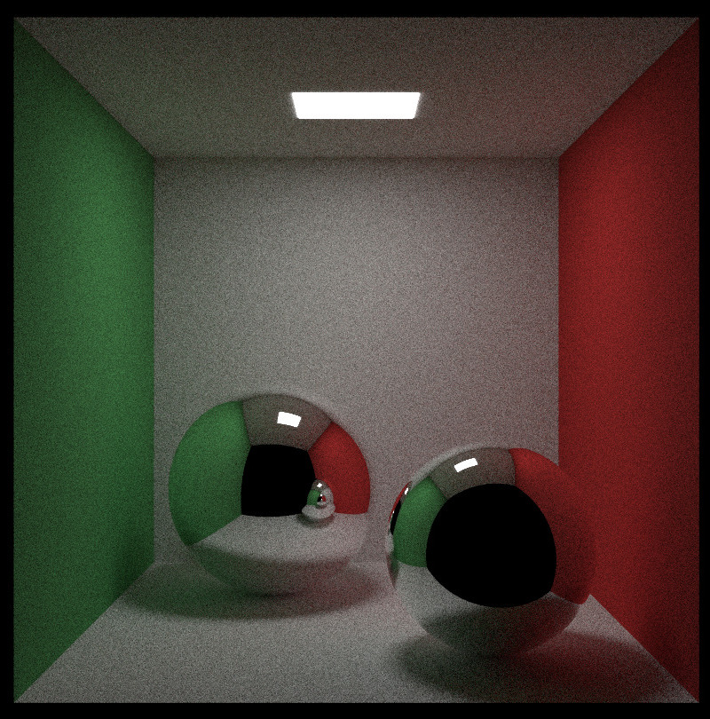

# Ryt 

## Overview

A minimal educational raytracer implemented in C++ CUDA.



## Features

- CUDA based parallel rendering
- PPM image output
- Multiple rendering backends - [CPU/GPU]
- BVH acceleration
- Anti-aliasing
- Reflections and Refractions

## Prerequisites

- NVIDIA GPU
- CUDA ToolKit 11.0+
- C++ Compiler
- CMake

## Build from source

```bash
git clone https://github.com/K-54TH15H/ryt.git
cd ryt
cmake -B build
cmake --build build
```

There is a example project which renders a Cornell box scene using the `ryt` library which is linked dynamically. 
The executable for the example is built inside `build/examples/cornelbox/cornelbox`

## Documentation

This project is not yet properly documented, as of now the project contains the report inside the `docs/`
folder which expresses the motive behind the decisions. There are a lot of rooms for imporvements, if you
are interested to contribute or open up an issue, feel free to do so.

## Licence

MIT License

## Acknowledgements

- Raytracing in One Weekend
- Sebastian Lague Coding Adventure - Raytracing

`Sathish K`
`112401032`
